#### 2019年4月7日18:08:51
- java8新特性学习
- 先将.java 文件通过编译器编译成字节码文件 然后通过jvm进行解释运行

- 刚才看了一下其中的一本书 发现有些东西是基础的东西 不太想看这个东西 我重新下载了一个java8 in action 我想了一下
    要不两本书一块进行学习吧！其中java8 in action为主 还有几个东西你也无需要准备一下 就是面试的东西
    因为这个不是百分之八 你需要把你之前学习的东西进行一个复习
- 饿！ java8 2014年就出来了 在过去的2018年 我还没有进行学习 现在赶紧把它补上来
- 这里需要说明一些东西  因为在学习java8的新特性的时候 肯定会有一个比较的过程 这时候你不要怕麻烦 把java8之前的处理的
    方法也进行一个复习(感觉大概率还是进行重新学习)
- 刚开想了一下 java学习的过程是一个非常庞大的过程 你需要学习的东西
1. java8新特性
2. java的多线程处理(你都知道面试会经常问，你不能一直不进行学习啊！)
3. 框架知识点(我觉得这个东西,可能我需要进行放置一下 spring boot spring cloud)
4. 数据库这里的学习，这个东西学习的知识点也很多 上次谦说得好多东西我都不知道
5. 接下来就是前端
    5.1 vue.js基础以及高阶教程
    5.2 angular.js基础以及高阶教程
    5.3 webpack打包
    5.4 node.js学习
6. 对了 还有好多东西 你还没有排上日程呢？ 比如 代码优化 算法等等 这些东西都是你要学习的

- 上面这些内容还只是一些基础教程 没有想要进行深入研究的基础上 说这些的目的就是你未来的学习任务是很重的
- 还需要进行一个说明 就是你今年的在学习的过程中不能再有

- 书中说到了java8引入的一个新特性就是stream<T> 我想到就是在实际的开发过程中，应该会应用到泛型这个概念
    用泛型的时候应该注意一下 注意点点应该是 有可拓展性把！ 对你未来的代码有什么影响没有
    这个延伸一点点就是 你在实际的开发过程中 不要想当然的去用一些东西 ArrayList 之类的
    稍微想一想 有什么可拓展性没有 应该书写成一种模块化的东西 
    
- 继续说java.util.stream 书中把它类比于linux中的一系列的指令 ps -ef|grep tomcat
    你可以把前面执行的命令的结果传递到后面   stream基本也是这样工作的(可能认识不够清晰)
    可以认为steam是一种花里胡哨的迭代器
- 第二个点就是 用行为参数化把代码传递给方法(这里大概的意思就是方法参数化)
    书中说了一个思想就是 ：重复使用现有的行为 实战1中的代码 我放到了day01中进行演示


- 还有一点就是接口现在有默认方法了
- 新增加了一个类 optional<T> 专门处理null的
- 还有就是多线程的一些讲解内容

#### 2019年4月8日20:03:35
- day02
- 在软件开发的过程中，不管你做什么，需求肯定是会发生变化的，这个是很正常的事情。想想过去一年在做这个项目的时候
    其中的需求也是经常发生变化的。回来来说这个事情的话，我自己是没有好好考虑这个东西的 就只一直在说可拓展性
    方便后续维护以及拓展 
- 针对上面的问题 在java8中就提出一个概念：行为参数化 帮助你处理频繁变更的需求的一种软件开发模式 这个就可以理解为
    把共同的处理，抽取成一个方法 然后具体的不同业务实现的代码当做一个参数传递到共同的代码处

- 具体的实例参照 day02其中的testFilter.java
- lambda表达式的学习 通过day2里面的代码 我们有在其中使用匿名类来处理 但是效果不好 因为有比较多的啰嗦代码
    在java8中我们引入了一个新工具 lambda表达式 现在你可以把lambda表达式看做匿名功能

1. lambda管中窥豹
- 可以把lambda理解为简洁的可传递的匿名函数的一种方式：它没有名称 但是它有参数列表 函数主体 返回类型 可能还有一个
    可以抛出异常的异常列表
- 匿名：因为它不想普通的方法一样拥有名称
- 函数：我们说它是函数 因为lambda不想方法那样属于某个类 但和方法一样 拥有参数列表 函数主题 返回类型 以及异常列表
- 传递：lambda表达式可以作为参数传递给方法或者存储在变量中
- 简洁：无需像匿名函数一样写很多的模板函数

- 对上面的图形进行说明
    参数列表-这里它采用了Comparator中compare方法的两个参数 两个Apple
    箭头 把参数和函数主体进行分割
    lambda主体 比较两个Apple的重量 表达式就是lambda的返回值


- java语言设计者为什么选择这种形式的语法，因为C# 和Scala等语言中类型的功能非常的受欢迎
```
    // lambda表达式的基本语法 这里你需要进行理解 你可以查看上面的5种有效的lambda表达式
    {parameters} -> expression
    {parameters} -> {statements;}
```


- 只要有显示的return 那么你一定要{} 进行包裹

- 在哪里能用到lambda表达式呢？
`filter(new ArrayList<Apple>(),(Apple apple) -> "red".equals(apple.getColor())`
- 接下进行学习函数式接口
```java
    // 什么是函数式接口呢？只定义一个抽象方法的接口
    // 像我们之前谈到的Comparator 和Runnable都是函数式接口     
    public interface Predicate{
        boolean test (T t);
    }
    
    public interface  Comparator<T>{
        int compare(T o1,T o2);
    }
    
    public interface  Runnable{
        void run();
    }
    // 这个不是函数式接口 因为它定义了两个add的抽象方法 其中一个是从Adder中继承的    
    public interface SmartAdder extends Adder{
        int add(double a, double b);
    }

```
- 那么函数式接口可以用来干什么呢？
- Lambda表达式允许你直接以内联的形式为函数式接口的抽象方法提供实现 并把整个表达式作为函数式接口的实例
    (具体来说 是函数式接口的一个具体实现的实例) 当然你也可以用匿名函数的方式进行实现 只不过比较笨拙
```
    // 使用匿名函数
    Runnable r1 = new Runnable(){
        public void run(){
            System.out.println("hello world 2");         
        }
    }
    // 使用lambda表达式
    // 这里进行一下说明 我记得上面在System.out..这里是需要添加{} 但是idea自带的提示表示可以不用进行添加
    // 基本的原则是可以掌握的 如果不知道的话 那么就用idea的只能提示把！ 或者返回值是void的时候也可以省略
    Runnable r2 = () -> System.out.println("hello world 1");
```

- 函数式描述
- 函数式接口的抽象方法的签名基本上就是lambda表达式的签名 我们将这种抽像方法叫做函数描述符例如， 
Runnable 接口可以看作一个什么也不接受什么也不返回（ void ）的函数的
签名，因为它只有一个叫作 run 的抽象方法，这个方法什么也不接受，什么也不返回（ void ）。
我们在本章中使用了一个特殊表示法来描述Lambda和函数式接口的签名。 () -> void 代表
了参数列表为空，且返回 void 的函数。这正是 Runnable 接口所代表的。 举另一个例子， (Apple,
Apple) -> int 代表接受两个 Apple 作为参数且返回 int 的函数。我们会在3.4节和本章后面的
表3-2中提供关于函数描述符的更多信息

- 上面说的内容我简单理解一下就是 你写的lambda表达式 必须和函数式接口的抽象方法类型
- 函数式接口有参数  有具体的返回   那么你lambda必须符合这个规则 (参数列表) -> {返回值}


#### 2019-4-9 20:18:20
- day03
- 把lambda表达式付诸实践
- 资源处理(处理文件/数据库)时候 最常见的模式就是打开一个资源 做一些处理 然后关闭资源 这些设置和清理阶段
    总是很相似的 并且会围绕着执行处理的那些重要代码 这就是所谓的环绕执行模式
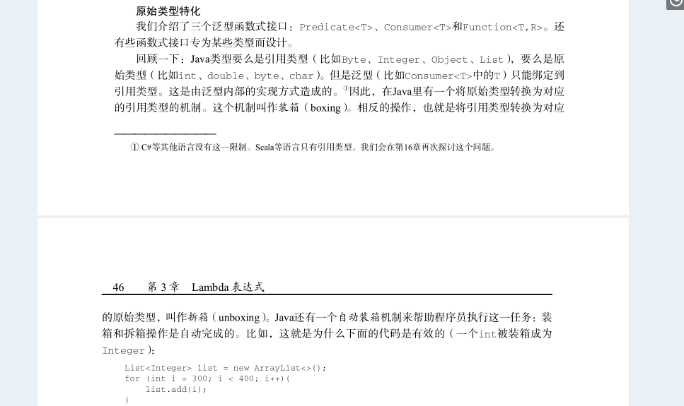
---
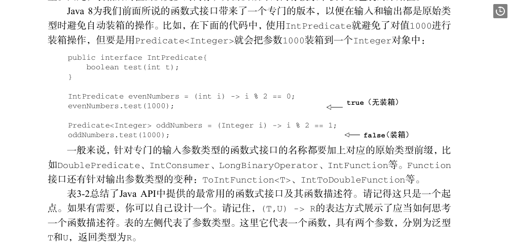
---
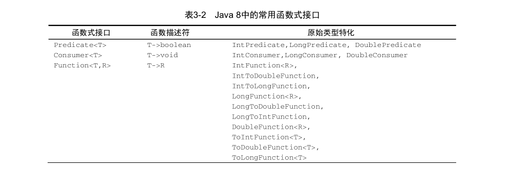
---
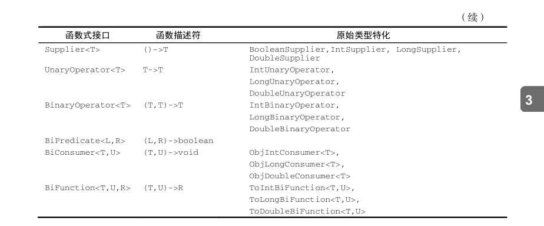
---
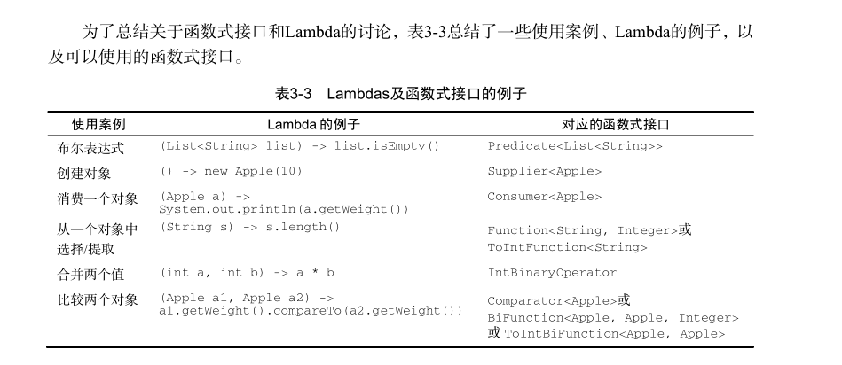

- 什么是checked exception?  举个例子：文件的读取 可能你的程序没有任何问题 但是有可能因为文件不存在导致异常
    这时候文件的读取你必须进行try catch 这个就是checked exception
---
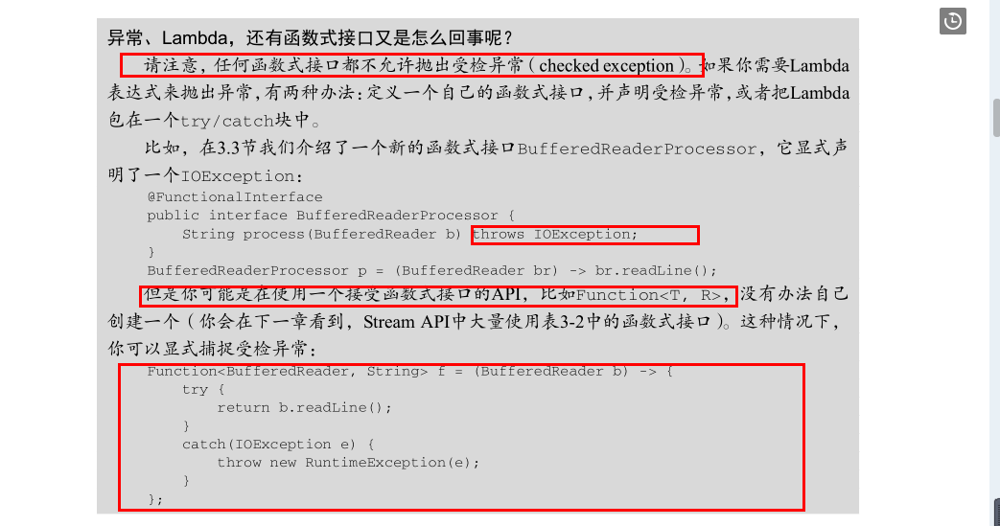
---
- 我认为这个很有利于你理解
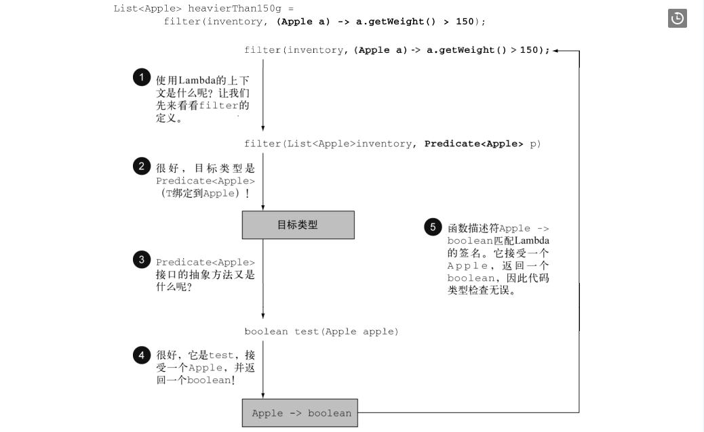

- 这里有一点学习一下 就是菱形运算符 利用泛型推断从上下文推断类型的思想 这么说可能不太理解
- 后面的ArrayList 就没有显示的指定类型 就是从前面进行推断出来的
`List<Integer> list1 = new ArrayList<>()`
- 特殊的void兼容规则 如果一个lambda的主体是一个表达式 它就和一个返回void的函数描述符兼容
    当然需要参数列表也兼容 这个是神意思呢？
```
    // 按理说list.add()返回的是一个boolean类型的 不能用Consumer  
    // 但是因为上面规则的说明 如果是一个表达式 那么它就和一个返回void的函数描述符兼容
    Predicate<String> p = s -> list.add(s);
    Consumer<String> c = s -> list.add(s);
```

- 类型推断：也就是我们在写lambda表达式的时候 我们不需要显示的指定参数类型 可以从前面的类型进行推断出来
    如果添加上类型，还是不添加类型这个需要让程序员自己决定
```
    // 这个就是没有显示指明a的类型
    List<Apple> filterList = filter(List<Apple> appleList,a -> a.getWeigth() > 15);
    // 一个显示 另一个与之相反
    Comparator<Apple> c = (Apple a1,Apple a2) -> a1.getWeight().compareTo(a2.getWeight());
    Comparator<Apple> d = (a1,a2) -> a1.getWeight().compareTo(a2.getWeight());
```

- 学习一个概念 闭包
[闭包解释](http://www.ruanyifeng.com/blog/2009/08/learning_javascript_closures.html)

- 成员变量存储在堆中 局部变量存储在栈中 对于闭包的一些理解能更好的理解下面的内容
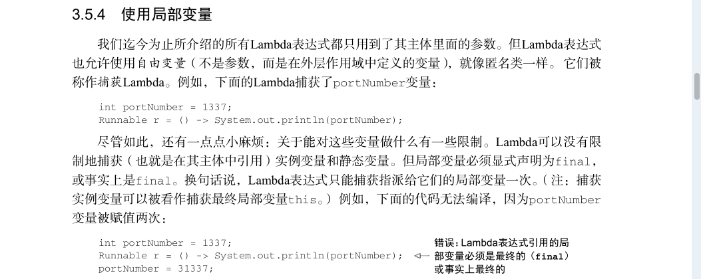
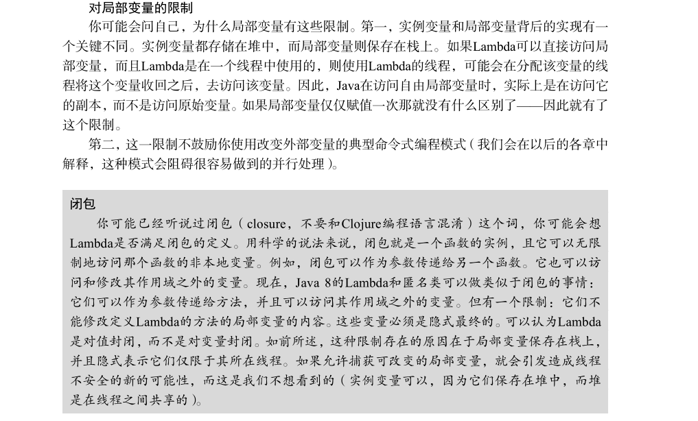


#### 2019年4月11日15:11:10
- day04
- 方法的引用 如果一个Lambda代表的只是“直接调用这个方法”，那最好还是用名称
来调用它，而不是去描述如何调用它。事实上，方法引用就是让你根据已有的方法实现来创建
Lambda表达式。但是，显式地指明方法的名称，你的代码的可读性会更好。当你需要使用方法引用时，目标引用放在分隔符 :: 前，方法的名称放在后面
`Apple::getWeight`
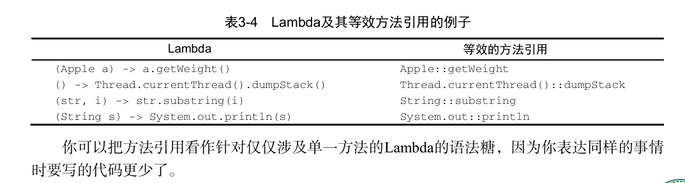

- 如何构建方法引用
1.指向静态方法的方法引用(例如Integer的parseInt方法 写作Integer::parseInt);
2.执行任意类型实例方法的方法引用(比如String的length方法,写作String::length);
3.指向现有对象的实例方法额方法引用(假设有一个变量XXX,用于存放xxx类型的对象，它支持实例方法getValue 那么你就可以写作XXX::getValue)

类似的String::length 这种方法的引用思想就是你在引用一个对象的方法 而这个对象本身就是Lambda的一个参数
例如表达式(String s) -> s.toUppercase() 可以写作String::toUppercase.
你在lambda中调用一个已经存在的外部对象中的方法
例如表达式() -> xxx.getValue()  可以写作 xxx::getValue

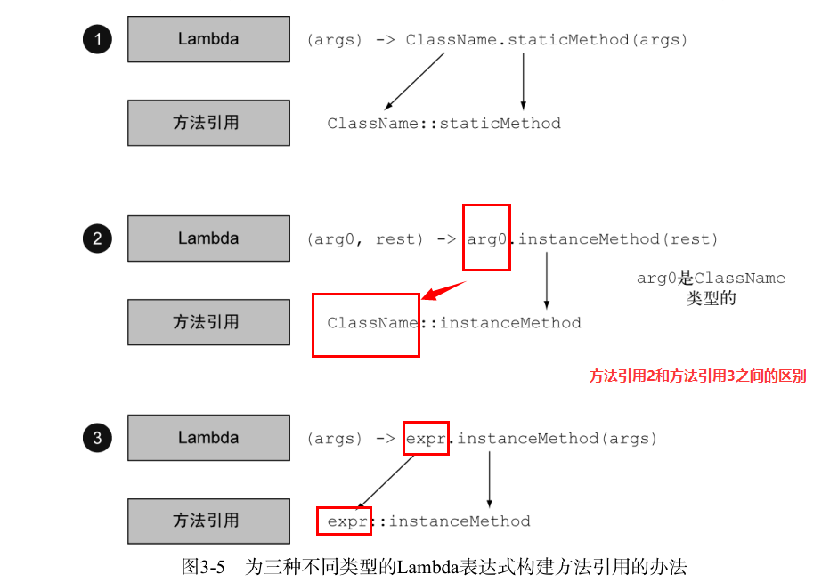 

- 构造函数引用
对于一个现有的构造函数，你可以利用它的名称和关键字new来创建一个它引用
className::new 
- 例如 假设有一个构造函数没有参数 它社和Supplier的签名 () -> Apple 我可以这样做
Supplier<Apple> c1 = Apple::new;(构造函数引用指向默认的Apple()的构造函数)
Apple a1 = c1.get();(调用supplier的get方法将产生一个新的Apple,注意这个get是supplier的默认方法 就和 predicate的test Consumer的accept function的apply)
等价于
Supplier<Apple> c1 = () -> new Apple();
Apple a1 = c1.get();

#### 2019-4-15 22:14:10
- day04

如果你的构造函数的签名是Apple(Integer weight) 那么它就适合Function接口 它是这样写的
Function<Integer,Apple> c2 = Apple::new;
Apple a2 = c2.apply(120);
等价于
Function<Integer,Apple> c2 = (weight) -> new Apple(weight)
Apple a2 = c2.apple(weight);
```
    // 一个由Integer构成的List每个元素都通过我们之前定义的map传递给Apple的构造函数
    List<Integer> weights = Arrays.asList(7,4,3,10);
    List<Apple> apples = map(weights,Apple::new);
    public static List<Apple> map(List<Integer> list,Function<Integer,Apple> f){
        List<Apple> result = new ArrayList<>();
        for(Integer e : list){
            result.add(f.appley(e));
        }
        return result;
    }
    // 如果你有一个具有两个参数的构造函数Apple(String color,Integer weight) 那么它适用于BigFunction接口的签名
    BigFunction<String,Integer,Apple> c3 = Apple::new;
    Apple a3 = c3.apple("green",120);// 这个就创建出一个新的Apple对象
    这个就等价于
    BigFunction<String,Integer,Apple> c3 = (color,weight) -> new Apple(color,weight);
    Apple a3 = c3.apple("green",120);
    
    // 你可以使用 Map来将构造函数映射到字符串值。你可以创建一个 giveMeFruit 方法，
    给它一个 String 和一个Integer ，它就可以创建出不同重量的各种水果：
    static Map<String,Function<Integer,Fruit>> map = new HashMap<>();
    static{
        map.put("apple",Apple::new);
        map.put("orange",Orange::new);
        // etc ..
    }
    public static Fruit giveMeFruit(String fruit,Integer weight){
        return map.get(fruit.toLowerCase()).apply(weight);
    }
```

- 复合lambda表达式的有用方法
- 这个的意思就是 你可以把多个简单的lambda表达式复合成复杂的表达式。你可以让两个谓词之间做一个 or 操作，
组合成一个更大的谓词。而且，你还可以让一个函数的结成为另一个函数的输入。 这里有一个重点就是我们都是用的是
默认的方法 详细信息请后面会进行介绍

- 比较器复合
```
    // 我们签名用到了一个Comparator.comparing()用于提取比较键值的Function 来返回一个Comparator
    Comparator<Apple> c1 = Comparator.comparing(Apple::getWeight);
    

```