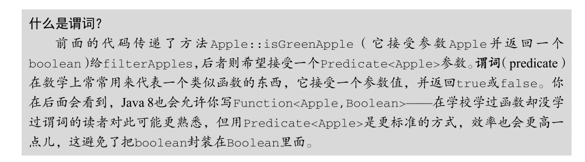
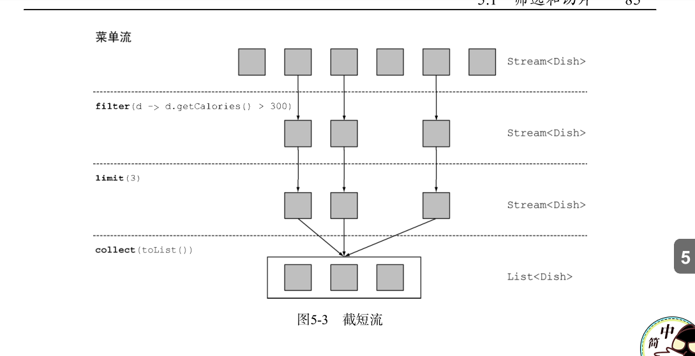
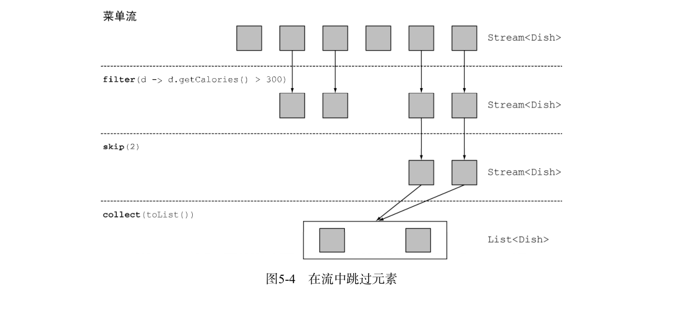
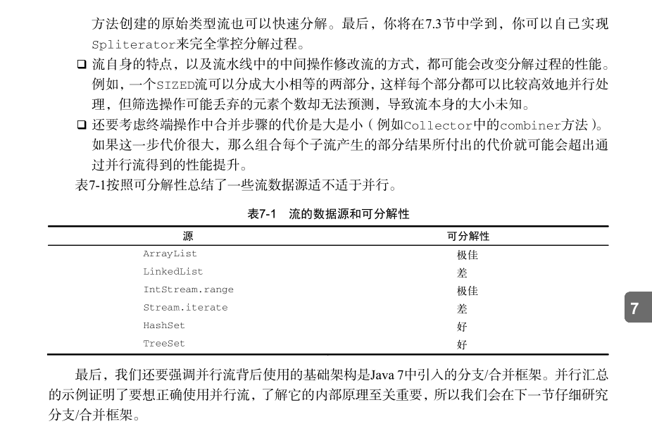
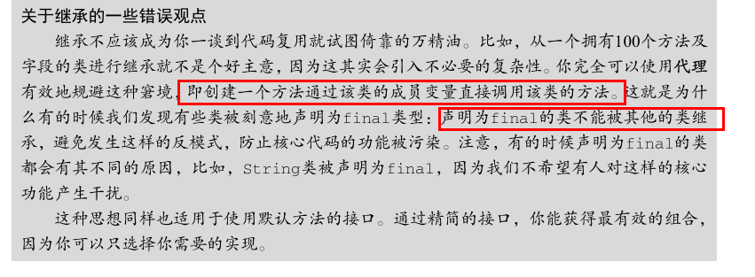
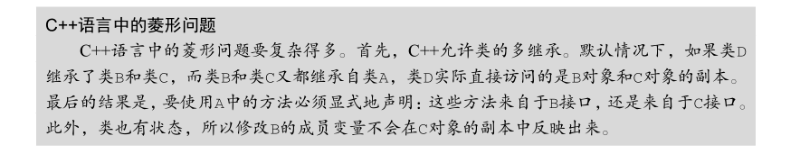

#### 2019年4月7日18:08:51
- java8新特性学习
- 先将.java 文件通过编译器编译成字节码文件 然后通过jvm进行解释运行

- 刚才看了一下其中的一本书 发现有些东西是基础的东西 不太想看这个东西 我重新下载了一个java8 in action 我想了一下
    要不两本书一块进行学习吧！其中java8 in action为主 还有几个东西你也无需要准备一下 就是面试的东西
    因为这个不是百分之八 你需要把你之前学习的东西进行一个复习
- 饿！ java8 2014年就出来了 在过去的2018年 我还没有进行学习 现在赶紧把它补上来
- 这里需要说明一些东西  因为在学习java8的新特性的时候 肯定会有一个比较的过程 这时候你不要怕麻烦 把java8之前的处理的
    方法也进行一个复习(感觉大概率还是进行重新学习)
- 刚开想了一下 java学习的过程是一个非常庞大的过程 你需要学习的东西
1. java8新特性
2. java的多线程处理(你都知道面试会经常问，你不能一直不进行学习啊！)
3. 框架知识点(我觉得这个东西,可能我需要进行放置一下 spring boot spring cloud)
4. 数据库这里的学习，这个东西学习的知识点也很多 上次谦说得好多东西我都不知道
5. 接下来就是前端
    5.1 vue.js基础以及高阶教程
    5.2 angular.js基础以及高阶教程
    5.3 webpack打包
    5.4 node.js学习
6. 对了 还有好多东西 你还没有排上日程呢？ 比如 代码优化 算法等等 这些东西都是你要学习的

- 上面这些内容还只是一些基础教程 没有想要进行深入研究的基础上 说这些的目的就是你未来的学习任务是很重的
- 还需要进行一个说明 就是你今年的在学习的过程中不能再有

- 书中说到了java8引入的一个新特性就是stream<T> 我想到就是在实际的开发过程中，应该会应用到泛型这个概念
    用泛型的时候应该注意一下 注意点点应该是 有可拓展性把！ 对你未来的代码有什么影响没有
    这个延伸一点点就是 你在实际的开发过程中 不要想当然的去用一些东西 ArrayList 之类的
    稍微想一想 有什么可拓展性没有 应该书写成一种模块化的东西 
    
- 继续说java.util.stream 书中把它类比于linux中的一系列的指令 ps -ef|grep tomcat
    你可以把前面执行的命令的结果传递到后面   stream基本也是这样工作的(可能认识不够清晰)
    可以认为steam是一种花里胡哨的迭代器
- 第二个点就是 用行为参数化把代码传递给方法(这里大概的意思就是方法参数化)
    书中说了一个思想就是 ：重复使用现有的行为 实战1中的代码 我放到了day01中进行演示


- 还有一点就是接口现在有默认方法了
- 新增加了一个类 optional<T> 专门处理null的
- 还有就是多线程的一些讲解内容

#### 2019年4月8日20:03:35
- day02
- 在软件开发的过程中，不管你做什么，需求肯定是会发生变化的，这个是很正常的事情。想想过去一年在做这个项目的时候
    其中的需求也是经常发生变化的。回来来说这个事情的话，我自己是没有好好考虑这个东西的 就只一直在说可拓展性
    方便后续维护以及拓展 
- 针对上面的问题 在java8中就提出一个概念：行为参数化 帮助你处理频繁变更的需求的一种软件开发模式 这个就可以理解为
    把共同的处理，抽取成一个方法 然后具体的不同业务实现的代码当做一个参数传递到共同的代码处

- 具体的实例参照 day02其中的testFilter.java
- lambda表达式的学习 通过day2里面的代码 我们有在其中使用匿名类来处理 但是效果不好 因为有比较多的啰嗦代码
    在java8中我们引入了一个新工具 lambda表达式 现在你可以把lambda表达式看做匿名功能

1. lambda管中窥豹
- 可以把lambda理解为简洁的可传递的匿名函数的一种方式：它没有名称 但是它有参数列表 函数主体 返回类型 可能还有一个
    可以抛出异常的异常列表
- 匿名：因为它不想普通的方法一样拥有名称
- 函数：我们说它是函数 因为lambda不想方法那样属于某个类 但和方法一样 拥有参数列表 函数主题 返回类型 以及异常列表
- 传递：lambda表达式可以作为参数传递给方法或者存储在变量中
- 简洁：无需像匿名函数一样写很多的模板函数

- 对上面的图形进行说明
    参数列表-这里它采用了Comparator中compare方法的两个参数 两个Apple
    箭头 把参数和函数主体进行分割
    lambda主体 比较两个Apple的重量 表达式就是lambda的返回值


- java语言设计者为什么选择这种形式的语法，因为C# 和Scala等语言中类型的功能非常的受欢迎
```
    // lambda表达式的基本语法 这里你需要进行理解 你可以查看上面的5种有效的lambda表达式
    {parameters} -> expression
    {parameters} -> {statements;}
```


- 只要有显示的return 那么你一定要{} 进行包裹

- 在哪里能用到lambda表达式呢？
`filter(new ArrayList<Apple>(),(Apple apple) -> "red".equals(apple.getColor())`
- 接下进行学习函数式接口
```java
    // 什么是函数式接口呢？只定义一个抽象方法的接口
    // 像我们之前谈到的Comparator 和Runnable都是函数式接口     
    public interface Predicate{
        boolean test (T t);
    }
    
    public interface  Comparator<T>{
        int compare(T o1,T o2);
    }
    
    public interface  Runnable{
        void run();
    }
    // 这个不是函数式接口 因为它定义了两个add的抽象方法 其中一个是从Adder中继承的    
    public interface SmartAdder extends Adder{
        int add(double a, double b);
    }

```
- 那么函数式接口可以用来干什么呢？
- Lambda表达式允许你直接以内联的形式为函数式接口的抽象方法提供实现 并把整个表达式作为函数式接口的实例
    (具体来说 是函数式接口的一个具体实现的实例) 当然你也可以用匿名函数的方式进行实现 只不过比较笨拙
```
    // 使用匿名函数
    Runnable r1 = new Runnable(){
        public void run(){
            System.out.println("hello world 2");         
        }
    }
    // 使用lambda表达式
    // 这里进行一下说明 我记得上面在System.out..这里是需要添加{} 但是idea自带的提示表示可以不用进行添加
    // 基本的原则是可以掌握的 如果不知道的话 那么就用idea的只能提示把！ 或者返回值是void的时候也可以省略
    Runnable r2 = () -> System.out.println("hello world 1");
```

- 函数式描述
- 函数式接口的抽象方法的签名基本上就是lambda表达式的签名 我们将这种抽像方法叫做函数描述符例如， 
Runnable 接口可以看作一个什么也不接受什么也不返回（ void ）的函数的
签名，因为它只有一个叫作 run 的抽象方法，这个方法什么也不接受，什么也不返回（ void ）。
我们在本章中使用了一个特殊表示法来描述Lambda和函数式接口的签名。 () -> void 代表
了参数列表为空，且返回 void 的函数。这正是 Runnable 接口所代表的。 举另一个例子， (Apple,
Apple) -> int 代表接受两个 Apple 作为参数且返回 int 的函数。我们会在3.4节和本章后面的
表3-2中提供关于函数描述符的更多信息

- 上面说的内容我简单理解一下就是 你写的lambda表达式 必须和函数式接口的抽象方法类型
- 函数式接口有参数  有具体的返回   那么你lambda必须符合这个规则 (参数列表) -> {返回值}


#### 2019-4-9 20:18:20
- day03
- 把lambda表达式付诸实践
- 资源处理(处理文件/数据库)时候 最常见的模式就是打开一个资源 做一些处理 然后关闭资源 这些设置和清理阶段
    总是很相似的 并且会围绕着执行处理的那些重要代码 这就是所谓的环绕执行模式

---

---

---

---


- 什么是checked exception?  举个例子：文件的读取 可能你的程序没有任何问题 但是有可能因为文件不存在导致异常
    这时候文件的读取你必须进行try catch 这个就是checked exception
---

---
- 我认为这个很有利于你理解


- 这里有一点学习一下 就是菱形运算符 利用泛型推断从上下文推断类型的思想 这么说可能不太理解
- 后面的ArrayList 就没有显示的指定类型 就是从前面进行推断出来的
`List<Integer> list1 = new ArrayList<>()`
- 特殊的void兼容规则 如果一个lambda的主体是一个表达式 它就和一个返回void的函数描述符兼容
    当然需要参数列表也兼容 这个是神意思呢？
```
    // 按理说list.add()返回的是一个boolean类型的 不能用Consumer  
    // 但是因为上面规则的说明 如果是一个表达式 那么它就和一个返回void的函数描述符兼容
    Predicate<String> p = s -> list.add(s);
    Consumer<String> c = s -> list.add(s);
```

- 类型推断：也就是我们在写lambda表达式的时候 我们不需要显示的指定参数类型 可以从前面的类型进行推断出来
    如果添加上类型，还是不添加类型这个需要让程序员自己决定
```
    // 这个就是没有显示指明a的类型
    List<Apple> filterList = filter(List<Apple> appleList,a -> a.getWeigth() > 15);
    // 一个显示 另一个与之相反
    Comparator<Apple> c = (Apple a1,Apple a2) -> a1.getWeight().compareTo(a2.getWeight());
    Comparator<Apple> d = (a1,a2) -> a1.getWeight().compareTo(a2.getWeight());
```

- 学习一个概念 闭包
[闭包解释](http://www.ruanyifeng.com/blog/2009/08/learning_javascript_closures.html)

- 成员变量存储在堆中 局部变量存储在栈中 对于闭包的一些理解能更好的理解下面的内容


#### 2019年4月11日15:11:10
- day04
- 方法的引用 如果一个Lambda代表的只是“直接调用这个方法”，那最好还是用名称
来调用它，而不是去描述如何调用它。事实上，方法引用就是让你根据已有的方法实现来创建
Lambda表达式。但是，显式地指明方法的名称，你的代码的可读性会更好。当你需要使用方法引用时，目标引用放在分隔符 :: 前，方法的名称放在后面
`Apple::getWeight`


- 如何构建方法引用
1.指向静态方法的方法引用(例如Integer的parseInt方法 写作Integer::parseInt);
2.执行任意类型实例方法的方法引用(比如String的length方法,写作String::length);
3.指向现有对象的实例方法额方法引用(假设有一个变量XXX,用于存放xxx类型的对象，它支持实例方法getValue 那么你就可以写作XXX::getValue)

类似的String::length 这种方法的引用思想就是你在引用一个对象的方法 而这个对象本身就是Lambda的一个参数
例如表达式(String s) -> s.toUppercase() 可以写作String::toUppercase.
你在lambda中调用一个已经存在的外部对象中的方法
例如表达式() -> xxx.getValue()  可以写作 xxx::getValue

 

- 构造函数引用
对于一个现有的构造函数，你可以利用它的名称和关键字new来创建一个它引用
className::new 
- 例如 假设有一个构造函数没有参数 它社和Supplier的签名 () -> Apple 我可以这样做
Supplier<Apple> c1 = Apple::new;(构造函数引用指向默认的Apple()的构造函数)
Apple a1 = c1.get();(调用supplier的get方法将产生一个新的Apple,注意这个get是supplier的默认方法 就和 predicate的test Consumer的accept function的apply)
等价于
Supplier<Apple> c1 = () -> new Apple();
Apple a1 = c1.get();

#### 2019-4-15 22:14:10
- day04

如果你的构造函数的签名是Apple(Integer weight) 那么它就适合Function接口 它是这样写的
Function<Integer,Apple> c2 = Apple::new;
Apple a2 = c2.apply(120);
等价于
Function<Integer,Apple> c2 = (weight) -> new Apple(weight)
Apple a2 = c2.apple(weight);
```
    // 一个由Integer构成的List每个元素都通过我们之前定义的map传递给Apple的构造函数
    List<Integer> weights = Arrays.asList(7,4,3,10);
    List<Apple> apples = map(weights,Apple::new);
    public static List<Apple> map(List<Integer> list,Function<Integer,Apple> f){
        List<Apple> result = new ArrayList<>();
        for(Integer e : list){
            result.add(f.appley(e));
        }
        return result;
    }
    // 如果你有一个具有两个参数的构造函数Apple(String color,Integer weight) 那么它适用于BigFunction接口的签名
    BigFunction<String,Integer,Apple> c3 = Apple::new;
    Apple a3 = c3.apple("green",120);// 这个就创建出一个新的Apple对象
    这个就等价于
    BigFunction<String,Integer,Apple> c3 = (color,weight) -> new Apple(color,weight);
    Apple a3 = c3.apple("green",120);
    
    // 你可以使用 Map来将构造函数映射到字符串值。你可以创建一个 giveMeFruit 方法，
    给它一个 String 和一个Integer ，它就可以创建出不同重量的各种水果：
    static Map<String,Function<Integer,Fruit>> map = new HashMap<>();
    static{
        map.put("apple",Apple::new);
        map.put("orange",Orange::new);
        // etc ..
    }
    public static Fruit giveMeFruit(String fruit,Integer weight){
        return map.get(fruit.toLowerCase()).apply(weight);
    }
```

- 复合lambda表达式的有用方法
- 这个的意思就是 你可以把多个简单的lambda表达式复合成复杂的表达式。你可以让两个谓词之间做一个 or 操作，
组合成一个更大的谓词。而且，你还可以让一个函数的结成为另一个函数的输入。 这里有一个重点就是我们都是用的是
默认的方法 详细信息请后面会进行介绍


#### 2019年4月16日20:29:49
- day05
- 前提说明 很多的业务逻辑都涉及数据库的操作  如果我们有一个菜的集合 我要筛选出有哪些菜的能量是比较低的
    可能之前我的操作就是进行迭代处理 如果我们使用SQL的话 就更加方便了  这里只是一个引子
- 流是什么？
- 流是java API的新成员 它允许你以声明式的方式处理数据集合（通过查询语句来表达 而不是临时编写一个实现）
- 现在浅显的理解就是把它看做一个遍历数据集的高级迭代器

- 流到底是什么？剪短的定义就是 **从支持数据操作处理的源生成的元素序列**
- 元素序列：就像集合一样 流也提供了一个接口 可以访问特定元素类型的一组有序值 集合的目的在于以特定的时间
    /空间复杂度存储和访问元素 但是流的目的是计算 比如之前的filter map sorted
- 源 流会使用一个提供数据的源 比如集合 数组 输入输出资源 请注意从有序集合生成流时会保留原有的顺序
- 数据处理操作 流的数据处理功能类似于数据库的操作 filter map reduce find 等等 流可以顺序执行也可以并行执行

- 流操作有两个重要的特点
- 流水线 很多流操作本身也返回一个流 这样多个操作就可以连接起来 形成一个大的流水线
- 内部迭代 与使用迭代器显式的迭代不同 流的迭代操作是在背后 进行的 

```
    // 其中menu表示的是现有的菜单
    List<String> threeHighCaloriesList = 
        menu.stream()
        .filter(d -> d.getCalories() > 300)  // 过滤热量大于300的
        .map(Dish::getName)         // 取菜名称
        .limil(3)                   // 只去前3个
        .collect(toList());         // 保存在另一个数组中
    // 说明 我们先对menu进行stream()处理 得到一个流 数据源是菜肴列表
    // 除了collect之外 其余的都是返回一个流 这样他们就形成了一条流水线
    // 你可以这么理解 链中的方法都在排队等待 直到调用collect方法

```

- filter 接受lambda表达式 从流中排除某些元素 lambda d -> d.getCalories() > 300
- map 将元素转为其他形式或者提取信息 Dish::getName  相当于 Dish dish -> {return dish.getName()}
- limit 截断流 使元素不超过给定的数量
- collect 将流转换为其他的形式 这里简单说明就是 将流中元素累积成一个汇总的结果的操作


- 只能遍历一次：流和迭代器类似 流只能遍历一次，遍历完之后 我们就说这个流已经被消费掉了
    但是你可以重新获得一个新的流来重新遍历一遍  另一个区别就是他们遍历数组的方式
```
    List<String> title = Arrays.asList("java8", "in", "action");
    Stream<String> s = title.stream();
    s.forEach(System.out::println);
    s.forEach(System.out::println);
    // 像这个就睡报一个错误 表示的额就是流已经被操作过了或者关闭
    Exception in thread "main" java.lang.IllegalStateException: 
        stream has already been operated upon or closed

```
- 内部迭代和外部迭代
- 使用Collection需要用户去做迭代(foreach) 这种我们成为之外部迭代 相反stream库是内部迭代
```
    // 我们使用foreach进行迭代 这个是一个语法糖 它的背后使用的是Iterator对象展现出来的更丑陋
    List<String> names = new ArrayList<>();
    for(Dish d : menu){
        names.add(d.getName());
    }
    // 用集合背后的Iterator进行迭代
    List<String> names = new ArrayList<>();
    Iterator<String> iterator = menu.iterator();
    while(iterator.hasNext()){
        Dish d = iterator.next();
        names.add(d.getName());    
    }
    // 我们使用内部迭代
    List<String> names = menu.stream()
                              .map(Dish::getName)
                              .collect(toList());
    // 可以查看到 这个的处理过程更加的方便

```

- 如果是外部的迭代处理的话  我们需要显式的进行迭代后 再对每个项目进行处理 如果你用内部迭代的话
    只要告诉我最终你要处理成什么样子 至于你先处理哪一个 这个由你自己决定 
    这差不多就是Java 8引入流的理由了——Streams库的内部迭代可以自动选择一种适
    合你硬件的数据表示和并行实现。


- 流操作
```
    List<String> names = menu.stream()
                             .filter(d -> d.getCalories() > 300)
                             .map(Dish::getName)
                             .limit(3)
                             .collect(toList());
    // 我们可以看到两类操作
    // filter map limit 可以连接成一个流水线
    // collect 触发流水线执行并关闭它
    // 可以连接起来的流操作称之为中间操作 关闭流的操作我们称为终端操作
```

- 中间操作：诸如filter sorted 等中间操作会返回一个流 让多种操作可以链接起来形成一个查询 除非流水线上
    触发一个终端操作 否则中间操作不会执行任何处理(他们很懒) 这是因为中间操作一般都可以合并起来 
    在终端操作一次性全部处理

- 终端操作：终端操作会从流的流水线生成结果，其结果是任何不适流的值 比如List Integer void 等等
`menu.stream().foreach(System.out::print)`


#### 2019年4月17日09:50:52
- 使用流

- 先学习筛选和切片：用谓词筛选 筛选出不相同的元素 忽略流中头几个元素 或者将流截短至指定长度

- 用谓词筛选
stream支持filter方法 该操作会接受一个谓词(一个返回值为boolean值的函数) 作为参数 并返回一个所有符合谓词元素的流
`List<Dish> vegetarianMenu = menu.stream().filter(Dish::isVegetarian).collect(toList())`


- 筛选各异的元素
- 流还支持distinct的方法，它会返回一个元素各异(根据流生成元素的equals和hashCode方法实现)的流
- 上面的潜台词就是 你如果你筛选自定义的类的时候 注意重新定义equals 和hashCode方法
```
    // 筛选出所有的偶数 并确保没有重复
    List<Integer> numbers = Arrays.asList(1,2,3,4,5,3,3,2,2);
    numbers.stream()
           .filter(r -> r % 2 == 0)
           .distinct()
           .foreach(System.out::print);
```


- 截短流 
- 流支持limit(n)方法 该方法返回一个不超过给定长度的流
```
    // 返回超过300卡路里的前三道菜
    List<Dish> dishs = menu.stream()
                           .filter(d -> d.getCalories() > 300)
                           .limit(3)
                           .collect(toList());
    // 如果流是有序的 则最多返回前n个元素 如果是流是一个set(无序的) 那么久只会返回n个 但是没有顺序
```



- 跳过元素
- 流还支持skip(n) 方法 返回一个扔掉前n个元素的流  如果流中不足n个元素 则返回一个空流
```
    // 目标找到卡路里大于300 并且跳过前两道菜
    List<Dish> dishes = menu.stream()
                            .filter(d -> d.getCalories() > 300)
                            .skip(2)
                            .collect(toList());
```


```
    // 筛选前两个荤菜
    List<Dish> dishes = menu.stream()
                            .filter(d -> d.getType() == Dish.Type.Meat)
                            .limit(2)
                            .collect(toList());
```

- 映射：一个非常常见的数据处理套路就是从某些对象中选中信息 比如在SQL中 你可以从列表中选取某一个列

- 对流中的每一个元素应用函数：流支持map方法 它会支持一个函数作为参数，它会接受一个函数作为参数。这个函数会被应用到每个元素上，并将其映
射成一个新的元素（使用映射一词，是因为它和转换类似，但其中的细微差别在于它是“创建一 个新版本”而不是去“修改”）。
```
    // 因为getName返回的是一个String  所以.map 返回的是一个Stream<String>
    List<String> dishNames = menu.stream()
                                  .map(Dish::getName)
                                  .collect(toList())
                                  
   // 给定一个单词列表 返回另一个列表 显示每个单词中有几个字母
    List<String> list1 = Arrays.asList("java8", "in", "action");
            list1.stream()
                    .map(String::length)
                    .collect(Collectors.toList())
                    .stream()
                    .forEach(System.out::println);
                    
    // 找出每道菜名称有多长
    List<Integer> list2 = menu.stream()
                               .map( r -> r.getName().length())
                               .collect(toList());
    // 这种方式更容易理解一点
    List<Integer> list3 = menu.stream()
                                .map(Dish::getName)
                                .map(String::length)
                                .collect(toList());
```


- 流的扁平化处理
```
    // 对于一张单词列表 找到其中各不相同的字符
    List<String> list = Arrays.asList("hello", "world");
        list.stream()
            .map(word -> word.split(""))
            .distinct()
            .collect(toList());
    // 查看书中的描述 发现这个其实有问题的  最终得不到想要的结果 你传递给map后 得到的是Stream<String[]>
    // 你真正想要的是Stream<String>
```


```
    // 尝试使用map和Arrays.stream()
    // 首先你需要一个字符流，而不是一个数组流 有一个Arrays.stream()的方法可以接受一个数组并产生一个流
    String[] arrayOfWords = {"hello","world"};
    Stream<String> streamOfworlds = Arrays.stream(arrayOfWords);
    // 把它放到流水线里面
    words.stream()
            .map(word -> word.splice(""))
            .map(Arrays::stream)   // 这里每个数组变成一个单独的流
            .distinct()
            .collect(toList());
    // 当前解决方案仍然不够  这是因为 你现在得到的是一个流的列表 也就是这里依旧是两个流
    // 我们可以使用flatMap来解决这个问题
    List<String> uniqueCharacters = words.stream()
                                            .map(word -> word.splice(""))
                                            .flatMap(Arrays::stream)
                                            .distinct()
                                            .collect(toList());
    // 上面简单解释一下就是 所有使用flatMap(Arrays::stream)将map生成的单个流都被合并起来了 扁平化成为一个流
```

- 我想 flatMap最好的解释就是上面这个场景 两个单词 查找出没有重复的字符  你不明白的话可以简单想一下这个

- 查找和匹配：另一个常见的数据处理套路就是看看 数据集中是否匹配一个给定的元素

- 检查谓词是否至少匹配一个元素
```
    // anyMatch方法可以回答"流中是否有一个元素能匹配给定的谓词"  
    // 你可以查看菜单里面是否有素食可选择
    if(menu.stream().anyMatch(Dish::isVegetarian)){
        System.out.println("这个是一个vegetarian");
    }
    // 通过实践可以了解到 anyMatch里面放置的是谓词  anyMatch后面再不能跟任何的.a 之类的操作 返回的是一个boolean类型的值
    // 表示的意义就是 在指定的元素中是否有满足要求的元素  有的话 就是true
    // 这个场景就和项目中的  只要这个图形中有柱状图 那么标志位就直接变成true 使用的前端的_.find(function(){})
   
```

- 检查谓词是否匹配所有的元素：它会看看流中的元素是否都能匹配给定的谓词
```
    boolean isHealthy = menu.stream()
                             .allMatch(r -> r.getCalories() < 100);

```
- 与allMatch相对的就是nonMatch 它可以确保流中没有任何元素与给定的谓词匹配
```
    boolean isHealthy = menu.stream()
                            .nonMatch(r -> r.getCalories() >= 1000);
```
- 简短说明一下 上面素有的anyMatch allMatch nonMatch 都用到了java中短路

- 查找元素
- findAny方法返回当前流中的任意元素 它可以与其他流操作结合使用
```
    // 你可能想找到一道素食菜肴
    Optional<Dish> dish = menu.stream()
                                .filter(Dish::isVegetarian)
                                .findAny();
    // 利用短路找到结果后立即结束
    
```

- Optional类介绍
- Optional<T> (java.util.Optional) 是一个容器类 代表一个值存在或不存在 引入这个类的目的是 避免和null检查相关的bug
- 介绍其中的一些方法
```
    // isPresent() 将在Optional包含值的时候返回true  否则返回false
    // ifPresent(Consumer<T> block) 会在值存在的时候执行给定的代码块
    // T get() 会在值存在时返回值 否则抛出一个异常 NoSuchElement异常
    // T orElse(T other) 会在值存在是返回值 否则返回一个默认值
    
    // 我们显式的判断Optoinal中是否有元素
    menu.stream()
        .filter(Dish::isVegetarian)
        .findAny()
        .isPresent();
```

- 查找第一个元素：出现一个有顺序的流 我们可能需要查找出第一个元素
```
    // 给出一个数字列表 找到第一个平方数能被3整除数 在代码中进行了实践
    // findAny 和 findFirst 他们之间的区别是并行  findFirst在并行上限更高 并行这个概念后面会学习

```

- 归约
- 到目前为止 所用到的终端操作 boolean(allMatch anyMatch nonMatch) void(foreach) Optional(findAny) 还有 .collect(toList())
- 接下来的学习是 如何把一个流中元素组合起来 使用reduce操作来表达更复杂的查询  比如计算菜单中的所有卡路里
    或者菜单中卡路里最高的是哪一个菜  这样的查询可以被归类为归约操作（将流归约成一个值）。
    用函数式编程语言的术语来说，这称为折叠（fold），因为你可以将这个操作看成把一张长长的纸（你的流）
    反复折叠成一个小方块，而这就是折叠操作的结果。
    
- 元素求和
```
    // reduce 接受两个参数 一个是初始值0 另一个是BinaryOperator<T> 将两个元素结合起来产生一个新的值
    lambda (a , b) -> a + b
    lambda (a , b) -> a * b
    int sum = list.stream().reduce(0, (a , b) -> a + b);
    // 这里右说了一个静态辅助方法 sum 来对两个数字求和  之前有一个静态辅助方法Comparator.comparing()
    int sum = list.stream.reduce(0,Integer::sum);
```


- reduce还有一个重载的变体 它不接受任何初始值 但是会返回一个Optional对象
`Optional<Integer> sum = numbers.stream().reduce(Integer::sum);`
- 考虑流中没有任何元素的情况。 reduce 操作无 法返回其和，因为它没有初始值。这就是为什么结果被包裹在一个 Optional 对象里，以表明和可能不存在
- 简单了解了一下 虽然这个没有默认值 虽然没有默认值 但是会根据前面的类型  给定一个默认值把
- 同样的我们可以使用静态辅助方法来获得最大值和最小值
```
    int maxValue = list.stream().reduce(Integer::max);
    int minValue = list.stream().reduce(Integer::min);
    // 没有初始值的sum  / max /min  这些返回的都是一个Optional类型的值 类似：Optional[45]
    // 当然我们里面也可以写三元表达式
    int maxValue = list.stream().reduce((x , y) -> x > y ? x : y);
```

----

---

---


#### 2019年4月18日09:22:07
- day07
- 第一部分的测试题在TraderAndTransactionTest中已经完成

- 数组流


- java8中引入了三个原始类型特化流来解决上面的问题 IntStream DoubleStream LongStream 分别将流中的元素特化为int double long
    从而避免了暗含的装箱成本。
```
    // 1.映射到数值流，将流转为特化版本的常用方法mapToInt mapToDouble mapToLong 这些方法和之前的map的工作方式是一样的
    // 只不过他么返回的是一个特化的流 而不是Stream<T>
    int calories = menu.stream()
                        .mapToInt(Dish::getCalories)   // 这里返回的就是一个IntStream
                        .sum();
    // 这里需要说明 如果流是空的 这个sum的默认值是0 还有其他的方法 比如 max  min average 等等
    
    // 2.转换为对象流 同样一旦有了数值流 我们可能需要将它转成非特化流
    IntStream intStream = menu.stream().mapToInt(Dish::getCalories); // 将stream转成数值流
    Stream<Integer> stream = inStream.boxed();   // 将数值流转成Stream
    
    // 3. OptoinalInt 求和那个列子很简单 因为有一个默认值0  但是如果你要使用max的时候 那么这时候用0显然是不合适的
    // 前面我们介绍了Optional<T> 存储一个存在或者不存在的容器 相对而言我们就可以用OptionalInt 来接受
    // 用特化流产生的IntStream DoubleStream等等 比如
    int max = menu.stream().mapToInt(Dish::getCalories).max(); // 这个肯定是是错误的 必须用OptionalInt来进行承接
    OptionalInt max = menu.stream().mapToInt(Dish::getCalories).max();
    // 如果没有一个默认值的话我们可以给定一个默认值
    int mm = max.orElse(1);
```

- 数值范围 和数字打交道 我们经常会有一些需求  取一定的范围 java8引入了两个可以用于IntStream 和 LongStream的静态方法
- 之前有两个静态辅助方法一个是Comparator.comparing()  还有一个.reduce(Integer::sum) 这两个方法
- 这两个范围 range 和rangeClosed 这两个方法都是第一个参数接受起始值 第二个参数接受结束值 range不包含结束值 
- rangeClosed包含结束值
```
    IntStream evenNumbers = IntStream.rangeClosed(1,100).filter(i -> i % 2 == 0);
    System.out.println(evenNumbers.count());
    // 注意上面哪一行代码是中中间操作 没有进行任何计算 后面的count() 是终端操作 会处理流
    list.stream().mapToInt(Integer::intValue).range(1,100); // 这个是不能执行的 
    // 有点想不明白 那这个IntStream 这个怎么用？ 我在项目中发他们是这样用的e
    IntStream.rangeClosed(0, xxx.size()) 等等
```

- 创建勾股数
```
    // 什么是勾股数  就是满足勾股定理的数字  并且他们必须是整数
    // 1.假设有人为你提供了 前两个数字 你怎么判断第三个数字符不符合要求
    filte(b -> Math.sqrt(a * a + b * b) % 1 == 0)
    // 把每个元素转换成一个勾股数呢
    stream.filter(b -> Math.sqrt(a * a + b * b) == 0)
            .map(b -> new Int[]{a , b ,Math.sqrt(a * a + b * b)});
    // 我们现在预设的情况就是 a的值给定 但是b的值需要生成 前面我们看到IntStream.rangeClosed() 可以在给定区间内
    // 生成一个数值流 我们可以用它来给B提供数值
    Instream.rangeClosed(1,100)
                .filter(b -> Math.sqrt(a * a + b * b) % 1 == 0)
                .boxed()
                .map(b -> new Int[]{a, b, Math.sqrt(a * a + b * b)});
    // 刚才还在纠结上面额写法到底对不对呢？ 是对的 为什么我们要把IntStream流 调用boxed() 转成Stream<Integer> 流
    // 因为IntStream流中的map方法只能为流中的每个元素返回一个int 我们可以用IntStream中的maptoObject的方法
    // 这个方法会生成一个对象值流
    Instream.rangeClosed(1,100)
                .filter(b -> Math.sqrt(a * a + b * b) % 1 == 0)
                                .mapToObj(b -> new Int[]{a, b, Math.sqrt(a * a + b * b)});
    // 现在我们来给定a的值
    Stream<int []> xxx =   Instream.rangeClosed(1,100).boxed()
                                    .flatMap(a  ->
                                    Instream.rangeClosed(a,100)
                                    .filter(b -> Math.sqrt(a * a + b * b) % 1 == 0)
                                    .mapToObj(b -> new int[]{a , b , Math.sqrt(a * a + b *b )}));
    // flatMap 方法在做映射的同时，还会把所有生成的三元数流扁平化成一个流。这样你就得到了一个三元数流。
    // 使用flatMap的一个关键词就是 扁平化  当时在字符串那里有一个很好的例子
    // 我们还能做得更好吗？ 我们可以在拿到所有的元素以后 再进行过滤 判断t[2] 是否是整数
```

- 由值创建流
- 我们可以通过静态方法Stream.of() 通过显示值创建一个流 它可以接受任意数量的参数
```
    Stream<String> stream = Stream.of("java8","lambda","in","action");
    stream.map(String::toUpperCase).foreach(System.out::println);
    // 当然 你也可以创建一个空流
    Stream<String> emptyStream = Stream.empty();
```

- 由数组创建流
- 我们可以使用静态方法Arrays.stream从数组中创建一个流 它可以接受一个数组作为参数 我们可以将一个int[] 数组转成IntStream
    我们如果用Arrays.stream的话 只能接受int  long double 的数组 注意 
```
    int[] numbers = {2,3,4,5,6};
    int sum = Arrays.stream(numbers).sum();
```


- 由函数生成流：创建无限流
- Stream API 提供了两个静态方法从函数生成流, Stream.iterator  Stream.generate 两个操作可以创建所谓的无限流 不像
    从固定集合创建的流那样有固定大小的流 一般来说应该使用limit(n)来对这种流进行限制

---

- 收集器学习
- 为什么要有这个收集器的概念  它肯定是为了解决一定的问题 所以才有这个概念


- 上面一个例子可以很明显的看出来 函数式编程和指令式编程之间的区别  函数式编程希望的结果就是做什么
      不关心你如何做 上面实现的过程中我们传递给collect() 方法的参数是Collector的一个实现
      也就是给Stream中元素做汇总的方法  之前我们一直传递的是Collection.toList() 也就是
      按顺序给每个元素生成一个列表
      
- 本章下面的内容主要讨论预定义收集器的功能 也就是哪些从Collections类提供的工厂方法 
    主要有3大功能 将流元素规约和汇总为一个值 元素分组 元素分区
    
但凡要把流中所有的项目合并成一个结果的时候 我们就可以用归集器
```
    long homManyDished = menu.stream().collect(Collectors.counting());
    long howManyDished = menu.stream().count();
    
```
- 查找流中的最大值和最小值  我们可以使用两个收集器 Collectors.maxBy 和 Collections.minBy 
    来计算流中的最大值和最小值 这两个收集器接受一个Comparator.comparing()参数
```
    Comparator<Dish> dishCaloriesComparator = Comparator.comparing(Dish::getCalores);
    Optional<Dish> mostCaloriesDish = menu.stream()
                                            .collect(maxBy(dishCaloriesComparator));
    // 这里为什么要用Optional<Dish> 因为这个有可能是空 这个是一个有值或者没有值的容器
    
    // Collectors类专门为了汇总提供了一个工厂方法 Collectors.summingInt函数 它可以接受一个
    // 把对象映射为求和所需int的函数 并返回给收集器  菜单列表的卡路里总热量
    int totalCalories = menu.stream().collect(Collectors.summingInt(Dish::getCalories));
    // 在遍历流的时候 会把每一菜映射为其的热量 然后把这个数字累加到一个累加器上  初始值是0
    // Collectors.summingLong  和Collectors.summingDouble 是一样的效果
    // 汇总不仅仅是求和 还有平均值 averagingInt averagingDouble averagingLong 
    double avgCalories = menu.stream().collect(Collectors.averagingInt(Dish::getCalories));
    // 有时候我希望通过一次收集器 就把所有的 max min avg 等等信息拿到
    // 我们可以使用summarizingInt 来完成 
    IntSummaryStatistics menuStatistics = menu.stream().collect(Collectors.summarizingInt(Dish::getCalories));
    // 同样的LongSummaryStatistics DoubleSummaryStatistics 用来收集Long 和 Double
    
```
- 连接字符串
- joining工厂方法的收集器会把流中每一个对象应用toString方法得到的字符串串连接成一个字符串
```
    String dishNameString = menu.stream().map(Dish::getName).collect(joining());
    // 这里需要说明一下 如果Dish中的toString() 方法就是返回菜肴的名称 那么我们可以直接这样写
    String dishNameString = menu.stream().collect(joining());
    // 如果你需要在其中进行一个分隔符的添加的话 你就需要使用Collectors.joining(", ");
    String dishNameString = menu.stream().collect(joining(", "));
```


#### 2019-4-19 09:55:39
- day08 
- 事实上我们基本上已经讨论了所有的收集器 都是一个可以用reducing工厂方法定义的归约过程的特殊情况而已
- 书中表述的概念就是 其他的方法就是一个具体的 能够表明具体是干什么用的  reducing方法就是总体来说的东西
```
    int totalCalories = menu.stream().collect(Collectors.reducing(0,Dish::getCalorise,(i,j) -> i + j));
    // 同样我们可以使用reducing来找到热量最高的菜肴
    Optional<Dish> mostCalories = menu.stream().collect(Collectors.reducing(
                      (d1, d2) -> d1.getCalories() > d2.getCalories() ? d1 : d2));
```

- 分组：还有一个我们常见的业务场景就是对集合中的项目进行分组操作  这个就是第一章其中的内容，如果我们现在
    需要按照菜肴的种类进行分类的话 按照以往的指令化代码 代码会非常的麻烦 啰嗦 如果我们按照函数式的方法

```
    Map<Dish.Type,List<Dish>> dishesByType = menu.stream().collect(Collectors.groupingBy(Dish::getType));

```

- 上面的分类条件可能比较简单一点 我们可以做一个稍微复杂一点的分类操作 比如按照calories的大小分为normal diet fat
```
    public enum CaloriesLevel {DIET,NORMAL,FAT};
    Map<CaloriesLevel,List<Dish>> dishByCaloriesLevel = menu.stream()
                        .collect(Colllectors.groupingBy(
                        dish -> {
                            if(dish.getCalories() <= 400 return CaloriesLevel.DIET);
                            else if(dish.getCalories() <= 700) return CaloriesLevel.NORMAL;
                            else return CaloriesLevel.FAT;
                        }));
    // 感觉上面的重点就是如何 为你自定义的分组类型进行逻辑梳理 
``` 

- 感觉这个好像在调试的时候不太好调试 所以你中间要梳理清楚你写的是怎么样的代码
- 多级分组 实现多级分组 我们基本的策略就是将内层的的groupingBy 传递给外层的groupingBy 
    在按照类型分类的基础上 然后再按能量进行区分。groupingBy(第一个分组规则，groupingBy(第二个分组规则))

```
    Map<Dish.Type, Map<CaloriesLevel, List<Dish>>> dishByTypeCalories = 
        menu.stream()
            .collect(Collectors.groupingBy(
                Dish::Type,groupingBy(dish -> {
                 if(dish.getCalories() <= 400 return CaloriesLevel.DIET);
                    else if(dish.getCalories() <= 700) return CaloriesLevel.NORMAL;
                    else return CaloriesLevel.FAT;
                })));

```


- 按子组收集数据 我们上面的例子就是把第二个groupingBy收集器传递给外层的收集器完成多级分组的功能
    但是进一步说 传递给第一个groupingBy的第二个收集器可以是任意类型的 不一定是groupingBy
    例如数一数每类菜有多少种？ 注意groupingBy是外层的传递给里层
`Map<Dish.Type, Long> typesCount = menu.stream().collect(Collectors.groupingBy(Dish::getType, Collectors.counting()));`

- 需要我们注意的是 普通的单参数groupingBy(f) 其中f是分类函数 实际上是groupingBy(f,Comparators.toList())的简便写法；

```
    Map<Dish.Type,Optional<Dish>> mostCaloriesByType = menu.stream()
                                                            .collect(groupingBy(Dish::getType,
                                                            maxBy(comparingInt(Dish::getCalories))));
    // 书中进行了一定的说明 就是我只有groupingBy生效的基础上 才会有后面的操作 所以这里的Optional<Dish> 不是很有效  
    // 因为maxBy返回的就是一个Optional<Dish> 类型  我们更希望它直接返回Dish类型
    Map<Dish.Type,Dish> mostCaloriesByType = menu.stream()
                                                   .collect(Collectors.groupingBy(Dish::getType),
                                                   Collectors.collectingAndThen(maxBy(ComparingInt(Dish::getCalories),
                                                    Optional::get)));
    // 这个工厂方法接受两个参数 要转换的收集器以及转换函数 并返回另一个收集器
                                                    
```


- 与groupingBy联合使用的其他收集器的例子
- 一般来说，通过groupingBy工厂方法的第二个参数传递的收集器将会到分到同一组中所有流元素执行进一步的规约操作。
#### 2019年4月22日19:51:15
- day09
- 我们还可以根据不同的类型 求出菜肴的总热量
```
    Map<Dish.Type,Integer> totalCaloriesByType = menu.stream().collect(
                                groupingby(Dish::getType,
                                summingInt(Dish::getCalories)));
    // 然而和grouping经常联合使用的是mapping  举例说明就是 你想知道不同类型的菜肴都是哪些CaloriesLevel
    Map<Dish.Type, Set<CaloriesLevel>>   caloriesLevelByType = menu.stream()
                                .cllect(groupingBy(Dish::getType,mapping(
                                dish -> {if (dish.getCalories() <=400) return CaloriesLevel.DIET;
                                else if(dish.getCalores() <=700) return CaloriesLevel.NORMAL;)
                                eles retun CaloriesLevel.FAT;),Collectors.toSet() )))                 
    // 这里的结果就是类似
    {OTHER=[DIET, NORMAL], MEAT=[DIET, NORMAL, FAT], FISH=[DIET, NORMAL]}
```

- 分区：是分组的特殊情况 由一个谓词(返回boolean类型的函数) 作为分类函数 它称为分区函数 这个潜台词就是
    Map 只有两个键 一个是true  一个false
```
    Map<Boolean, List<Dish>> partitionedMenu = menu.stream().collect(
                            partitioningBy(Dish::isVegetarian));
    // 返回的实例 大概的样子
    {false=[pork, beef, chicken, prawns, salmon],
    true=[french fries, rice, season fruit, pizza]}
```
- 分区的优势 就是我们保留了两组数据 一组是素食 一组是非素食
```
    // 像下面的代码 就是处理完全是素食的食材
    List<Dish> isVegetarian = menu.stream().filter(Dish::getVegetarian).collect(Collectors.toList());
    // 我们还可以将分区传递给下一个分组
    Map<Boolean, Map<Dish.Type,List<Dish>>> vegetarianDishesByType = menu.stream().collect(
                                            partitioningBy(Dish::getVegetarian),
                                            groupingBy(Dish::getType));
    // 产生的是一个二级分组map
    {false={FISH=[prawns, salmon], MEAT=[pork, beef, chicken]},....
    // 我们同样可以找到素食和非素食中热量最高的菜肴
    Map<Boolean,Dish> mostCaloriesPartitionByVegetarian = menu.stream().collect(
                                        partitioningBy(Dish::getVegetarian),
                                        collectionAndThen(Comparator.comparingInt(Dish::getCalories)),
                                        Optional::get)));
    
```
- Collectors的静态方法截图


- 自己创建收集器 这里我没有进行学习 回头想要学习的话 记得查看6.6章节


- 怎么理解这个并行处理流：并行流就是一个把内容分为多个数据块，并用不同的线程分别处理每个数据流，这样一来你就可以
    自动把给定操作的工作负荷分配给多核处理器的内核 让他们都忙起来

---

---

--- 


--- 



- 分支/合并框架：目的就是以递归的方式将可以并行的任务拆分成更小的任务 然后将每个子任务的结果合并起来生成整体的结果
   它是ExecutorService接口的一个实现 它把子任务分给线程池（ForkJoinPool）中的工作线程

#### 2019年4月23日20:16:40
- day10

- 使用RecursiveTask  recursive(递归)
- 我们要把任务提交到这个池 必须创建RecursiveTask<R> 的一个子类 其中R是并行化任务(以及所有子任务)产生的结果类型
    或者任务不返回结果 则是RecursiveAction类型 要定义RecursiveTask 只需要实现它的唯一的一个抽象方法compute
`protected abstract R compute()`
- 这个方法定义了拆分成子任务的逻辑 以及无法再拆分或者不方便拆分时 生成单个子任务结果的逻辑
```
    // 我们可以书写一个伪代码
    if(任务足够小或者不可分){
        顺序计算该任务
    }else{
        将任务分成两个子任务
        递归调用本方法 拆分每个子任务 等待所有子任务完成
        合并每个子任务的结果
    }    

```

---

---

---

- 简要说明：虽然我们CPU的核数是很少的 我们还是尽可能的将任务分成很小的部分  每个核上的任务是成双向链式队列 
    当一个任务执行完毕以后 就会从链上取下另一个任务  当一个线程的任务执行完毕以后 就从其他线程上的链上最后
    取一个任务继续执行 这样的基本描述就是工作窃取

- 下一章也没有进行学习  7.3章节

- 高效java8编程 如果你是全新额java项目 那就非常好了 你直接用java8的新特性就好了 但是现在我们一般都是在
    原有的项目的基础上进行迭代开发的 所以这一章主要的内容就是 怎么用java8的新特性修改之前的代码

#### 2019年4月24日20:23:53
- day11
- 接下来我们学习的内容是接口的默认方法
- 为什么会有这个问题呢？ 传统的java接口，如果一个类要实现接口 必须实现接口的所有的方法 如果我现在在接口中
    添加一个方法以后 现存的实体类往往不在接口设计者的控制范围之内 这些实体为了适配新的接口约定也需要进行修改
    因为在java8 API中 现存的接口引入了很多的新的方法  这种问题越发的严重 也就是不能为了兼容的问题  
    更改所有值钱所有书写的接口实现类 java8为了解决这一问题 引入一种全新的机制 
    java8中接口现在支持在声明方法的同时提供实现
- 有两种方式可以完成这种操作 java8允许在接口内声明静态方法 这个没有修饰符 
    第二个java8引入一个新功能 叫默认方法 通过默认方法你可以指定接口方法的默认实现 也就是接口能够提供方法的
    具体实现 这个有default修饰符 
- 说明：具体的实现类之前需要有修饰符default 我们就知道这个方法是不是默认方法 

- 我们为什么要在乎默认方法


--- 


- 我们该怎么辨别哪些是默认方法呢？默认方法由default修饰符修饰
```
    // 举例 这里面有一个抽象方法  以及一个默认方法isEmpty()
    public interface Sized{
        int size();
        default boolean isEmpty(){
            return size() == 0;
        }
    }

```
- 这里遗留一个问题就是 某种程度是不是说java是多继承 就是说 你接口有一个方法的实现 但是我实现你接口的方法
    也有同样的方法 这个怎么说 这个东西后面章节会进行介绍的
- 什么是函数式接口 只有一个抽象方法的接口  注意默认方法不是抽象方法 静态方法也不是抽象方法

- 抽象类
    - 抽象类 public class Abstract Demo{}
    - 抽象类 可以有抽象方法 抽象方法必须用Abstract进行修饰   和一般的方法  如果一个类中有抽象方法
        那么这个类一定是抽象类
    - 子类继承抽象类 那么一定会继承抽象类中的抽象方法 如果子类要重写父类中的一般方法会有提示需要加上标识
        @override 
        
- 默认方法的使用 我们可以创建自己的接口 为其提供默认方法 我们会用两种默认方法的两种用例 
    - 可选方法

    - 行为的多继承

-  java类只能单一继承某个类 但是一个类可以实现多个接口 但是由于java8中接口可以包含实现
    类可以从多个接口中继承它们的行为(即代码的实现)

- 我们可以利用正交的方法来精简接口 可能不太明白这个正交是什么东西？ 距离说明
    你现在创建一个图形接口 有的需要调整图形的大小 有的需要调整图形的旋转角度
    现在依托java8的新特性 接口可以有方法的实现 在接口中 我们可以把图形的大小的设置为抽象方法
    但是把调整角度的方法的具体实现在接口中农直接实现了 用的就是这种正交的方式
 

- 有一个问题就是 如果一个类同时实现两个接口 (原来没有实现的时候，也会有这个问题 在TestDemo中有简单解释)
    这两个接口拥有相同的方法实现 那么这个问题该怎么解决

- 在day11中的有一些实例 我们重点关注C类 (这里说明一下，为什么没有出现D这种情况呢？ 因为这个直接回报错 
    不让你这种写法进行下去的 可以的方式就是A接口有一个实现方法 B方法继承A 同样有自己的实现方法 
    然后C 同时继承A 和B  这个就是我们需要探讨的问题)
- 如果一个类使用相同额函数签名从多个地方继承了该函数 解决问题的3条规则
    1.类中的方法优先级别最高 类或父类中声明的方法优先级别高于任何声明为默认方法的优先级别
    2.如果无法通过第一条进行判断 那么子接口的优先级别更高 函数签名相同的时候 优先选择拥有最具体实现
        的默认方法的接口 如果B继承了A 那么B就比A更加具体
    3.最后如果还是没有办法判断的话 继承多接口的类必须通过显示的覆盖和调用期望的方法 显示的选择使用哪一个
        默认方法的实现
- 具体的请查看C类

- 还有一种就是关于菱形继承问题的
```java
    public interface A{
        default void hello(){
            System.out.println("say hello from A");
        }
    }
    
    public interface B extends  A{ }
    public interface C extends  A{ }
    public class  D implements B ,C{
        public static void main(String[] args){
            new D().hello();
        }
    } 
    
    // 上面的如果你画一个UML图 就可以发现这是一个菱形的继承图
    // 分析来看因为B C 都没有显式的写出实现 所以最打印的还是A中的hello方法
    // 如果我们在B 中重写 A 的方法 那么打印的就是 B中的 根据规则1
    // 如果我们在C 中重写 A 的方法 那么你就要使用 B.super.hello()/A.super.hello() 显式的说明你要调用谁

```

- 了解信息


#### 2019年4月25日22:51:55
- day12
- 在之前的代码中经常会有一个问题 就是我们需要处理空指针异常 这个异常键值不要太常见了 反正你需要时刻的注意这个问题
    一种业务场景就是不断的依托的形式 就是现在的业务依托上面的业务的返回 然后下面的业务依托刚才的业务
    那你就需要进行多成判断了 如果一个为空 那么你空调用业务一定返回的是空  
- 对于代码中有空的引起的一些问题
    它是错误之源 是目前开发中最典型的异常
    它使你的代码充斥着深层嵌套的null检查代码的可读性不叫糟糕
    它本身没是没有任何意义的
    它破坏了java的哲学 书中说java一直避免让java的开发人员意识到指针的存在
- 综上所述 我们在java8中 引入了一个Optional类

- 比如我们使用Optional<Car> 只是对类进行简单的封装 变量不存在的时候 确实的值会被建模成一个 空 的Optional对象
    由Optional.empty();

#### 2019年4月27日18:50:11
- day 12
- 使用Optional而不是null的一个非常重要而实际的语义区别 我们在使用的时候 用Optional<Car> 就表明这里发生变量缺失是
    允许的 相反的 如果你使用Car 这个变量如果这个图变量是null  那么你就要对这个变量进行业务逻辑处理
    
- 使用Optional的简单实例 可以查看day12中的额Insurance

- 我们现在开始学习使用Optional 创建Optional对象


- 这个类设计之初 没有考虑其中像在类中使用的这种情况 我在day12中定义的Car类中Insurance这种写法


- 默认行为以及解引用Optional对象 Optional类中提供了多种方法读取其中的值
```
    Optional<Car> carOptiona = Optional.of(new Car());
  // get() 方法是最简单又是对不安全的 如果变量存在则之间返回存在变量中的值 否则就抛出一个
  // NoSuchElementException的异常 如果你非常确定Optional中是有值的 要不然尽量不要使用
  // 这个方法
    carOptional.get();
  // orElse() 这个允许你在Optional值不包含值的时候 提供一个默认值
    ....orElse("unknown");
  // orElseGet(Supplier<? extends T> other) 是orElse()方法的延迟调用版 如果创建默认值是一件非常耗时的事情
  // 那么我们可以用这个方法 或者你非常确定某个方法仅在Optional为空的时候调用
  // 下面的也可以写成方法 在里面进行调用
    ...orElseGet((Supplier<String>)() -> "xxx") 
  // orElseThrow(Supplier<? extends X> exceptionSupplier) 和get方法类似  抛出一个异常 
  // 我们使用这个的目的就是定制自己的异常类 和上面的方法是类似的
  
  // ifPresent(Consumer<? super T>) 能让你在变量值存在的时候执行一个作为参数传入的方法
```
- 两个Optional对象的组合


```
    // 如果你想查找找 德玛西亚 保险公司
    if(insurance != null && "德玛西亚".equals(insurance.getName())){System.out.println("ok");}
    // 如果我们使用 Optional的操作
    Optional<Insurance> optInsurance = ....;
    optInsurance.filter(insurance -> "德玛西亚".equals(insurance.geName()))
                .ifPresent(() -> System.out.println("ok"));
    // filter 可值钱一样接受一个谓词 如果它符合谓词的条件 那么返回这个对象 我们之前说个Optional对象可以
    // 当做只有一个对象的stream  如果对象为空 不进行任何操作 如果不为空谓词操作为true  也不进行任何处理
    // 这及返回该Optional对象
```

---


 
 
#### 2019年4月28日20:31:34
- day13
    
- 这一章我们主要的目的就是学习在java8中新的一个时间类  为什么会有这个类呢？ 之前我们有两个关于时间的类
    一个是java.util.Date  一个是Calender类 


- 我们在java8中引入了java.time 这个类


--- 

---
