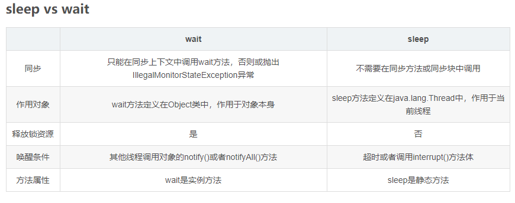

- 堆和栈的区别
1. 存放的内容不同
栈内存：用来存放基本数据类型变量和引用类型变量
堆内存：用来存放运行时通过new关键字创建的对象
2.存取速度不同
栈的存取速度比较快
堆在运行时动态分配内存 生命周期不用提前告诉编译器 这也导致堆的存取速度比较慢
3. 生命周期
栈内存存放的变量生命周期一旦结束就会被释放 而堆内存存放的实体会被垃圾回收机制不定时的回收
创建了两个对象 一个常量池的对象 一个堆上的对象
- transient 有什么作用？
只要实现serializable接口，将不需要序列化的属性前面添加关键字transient 序列化对象的时候 这个属性就不会被序列化
- 匿名内部类是否可以继承其他类或者实现接口 请写出一个匿名内部类的实例
可以继承其他类 但是不能用extends
可以实现某个接口 但不能用implements
```java
    public class A {
        public void a() {
            System.out.println("aaa");
        }
    }
    
    class B {
        public static A getA() {
            return new A() {
                @Override
                public void a() {
                    System.out.println("bbb");
                }
            };
        }
    }
```
- 现在有T1... 怎么进行实现
```java
    public class JoinTestSync {
    
        public static void main(String[] args) throws InterruptedException {
            // TODO Auto-generated method stub
            ThreadJoinTest1 t1 = new ThreadJoinTest1("今天");
            ThreadJoinTest1 t2 = new ThreadJoinTest1("明天");
            ThreadJoinTest1 t3 = new ThreadJoinTest1("后天");
            /*
             * 通过join方法来确保t1、t2、t3的执行顺序
             * */
            t1.start();
            t1.join();
            t2.start();
            t2.join();
            t3.start();
            t3.join();
        }
    
    }
    
    class ThreadJoinTest1 extends Thread {
        public ThreadJoinTest1(String name) {
            super(name);
        }
    
        @Override
        public void run() {
            for (int i = 0; i < 5; i++) {
                System.out.println(this.getName() + ":" + i);
            }
        }
    
    }
```
- java中wait和sleep有什么区别


- sql
select * from (select * from M order by m_date desc) a limit 200,100;

- 注解
@Controller @Service  @Autowired
```java
    /** 
     * 方法访问角色注解 
     */  
      
    @Target(ElementType.METHOD)  
    @Retention(RetentionPolicy.RUNTIME)  
    @Documented  
    @Inherited  
    public @interface VisitorRole {  
        String value();   
    }
```

-
```java
   public class Sort {
       public static void main(String[] args) {
           int[] i1 = new int[]{-2, 4, 7, 8, 10};
           int[] i2 = new int[]{3, 4, 7,8, 9};
           int[] i3;
           int iMax = i1[i1.length - 1] > i2[i2.length - 1] ? i1[i1.length - 1]
                   : i2[i2.length - 1];
           int iMin = i1[0] < i2[0] ? i1[0] : i2[0];
           i3 = new int[iMax - iMin + 1];
           for (int i = 0; i < (i1.length <= i2.length ? i2.length : i1.length); i++) {
               if (i < i1.length) {
                   if (i3[i1[i] - iMin] == 0) {
                       i3[i1[i] - iMin] = i1[i];
                   } else {
                       System.out.println(i3[i1[i] - iMin]);
                   }
               }
               if (i < i2.length) {
                   if (i3[i2[i] - iMin] == 0) {
                       i3[i2[i] - iMin] = i2[i];
                   } else {
                       System.out.println(i3[i2[i] - iMin]);
                   }
               }
           }
           System.out.println(Arrays.toString(i3));
       }
   }
```


- 消费者
```java
    public class ProAndCon {
        //最大容量
        public static final int MAX_SIZE = 2;
        //存储媒介
        public static LinkedList<Integer> list = new LinkedList<>();
     
        class Producer implements Runnable {
            @Override
            public void run() {
                synchronized (list) {
                    //仓库容量已经达到最大值
                    while (list.size() == MAX_SIZE) {
                        System.out.println("仓库已满，生产者" + Thread.currentThread().getName() + "不可生产.");
                        try {
                            list.wait();
                        } catch (InterruptedException e) {
                            e.printStackTrace();
                        }
                    }
                    list.add(1);
                    System.out.println("生产者" + Thread.currentThread().getName() + "生产, 仓库容量为" + list.size());
                    list.notify();
                }
            }
        }
     
        class Consumer implements Runnable {
     
            @Override
            public void run() {
                synchronized (list) {
                    while (list.size() == 0) {
                        System.out.println("仓库为空，消费者" + Thread.currentThread().getName() + "不可消费.");
                        try {
                            list.wait();
                        } catch (InterruptedException e) {
                            e.printStackTrace();
                        }
                    }
                    list.removeFirst();
                    System.out.println("消费者" + Thread.currentThread().getName() + "消费，仓库容量为" + list.size());
                    list.notify();
                }
            }
        }
     
     
        public static void main(String[] args) {
            ProAndCon proAndCon = new ProAndCon();
            Producer producer = proAndCon.new Producer();
            Consumer consumer = proAndCon.new Consumer();
     
            for (int i = 0; i < 10; i++) {
                Thread pro = new Thread(producer);
                pro.start();
                Thread con = new Thread(consumer);
                con.start();
            }
        }
     
    }
    
```